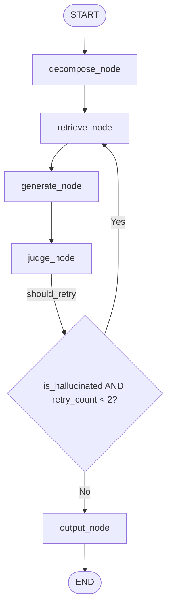

## Overview

The DocMind workflow is implemented using LangGraph's `StateGraph`. It orchestrates the flow from query decomposition through retrieval, generation, evaluation, and output, with built-in retry logic for hallucination detection.

## build_graph_workflow

Builds and compiles the complete DocMind workflow graph.

```python
def build_graph_workflow() -> StateGraph
```

**Returns:**
<ResponseField name="return" type="StateGraph">
  Compiled LangGraph workflow ready for execution
</ResponseField>

**Implementation:**
```python
from langgraph.graph import StateGraph, END
from nodes import (
    decompose_node,
    generate_node,
    judge_node,
    output_node,
    retrieve_node,
    should_retry
)
from state_types import DocMindState

def build_graph_workflow() -> StateGraph:
    workflow = StateGraph(DocMindState)

    # Add nodes
    workflow.add_node("decompose", decompose_node)
    workflow.add_node("retrieve", retrieve_node)
    workflow.add_node("generate", generate_node)
    workflow.add_node("judge", judge_node)
    workflow.add_node("output", output_node)
    
    # Add edges
    workflow.set_entry_point("decompose")
    workflow.add_edge("decompose", "retrieve")
    workflow.add_edge("retrieve", "generate")
    workflow.add_edge("generate", "judge")
    
    # Add conditional edges
    workflow.add_conditional_edges(
        "judge",
        should_retry,
        {
            "retry": "retrieve",
            "output": "output"
        }
    )
    
    workflow.add_edge("output", END)
    
    return workflow.compile()
```

## Graph Structure

### Nodes

The workflow consists of 5 nodes:

<ParamField path="decompose" type="Node">
  Entry point. Decomposes user query into structured sub-queries.
  
  **Function:** `decompose_node`
</ParamField>

<ParamField path="retrieve" type="Node">
  Retrieves relevant documentation sections based on query and decomposition.
  
  **Function:** `retrieve_node`
</ParamField>

<ParamField path="generate" type="Node">
  Generates response from retrieved sections.
  
  **Function:** `generate_node`
</ParamField>

<ParamField path="judge" type="Node">
  Evaluates generated response for hallucinations and quality.
  
  **Function:** `judge_node`
</ParamField>

<ParamField path="output" type="Node">
  Produces final output based on judge verdict.
  
  **Function:** `output_node`
</ParamField>

### Edges

The workflow defines both fixed and conditional edges:

#### Fixed Edges

```python
# Linear flow through initial nodes
workflow.set_entry_point("decompose")  # Start here
workflow.add_edge("decompose", "retrieve")
workflow.add_edge("retrieve", "generate")
workflow.add_edge("generate", "judge")
workflow.add_edge("output", END)  # Terminate here
```

**Flow:**
```
START → decompose → retrieve → generate → judge → [conditional] → output → END
```

#### Conditional Edges

```python
workflow.add_conditional_edges(
    "judge",
    should_retry,
    {
        "retry": "retrieve",
        "output": "output"
    }
)
```

**Logic:**
- After `judge` node completes, `should_retry` function determines next node
- If `should_retry` returns `"retry"`: Loop back to `retrieve` node
- If `should_retry` returns `"output"`: Proceed to `output` node

**Decision criteria:**
```python
def should_retry(state: DocMindState) -> str:
    verdict = state.get("judge_verdict", {})
    retry_count = state.get("retry_count", 0)
    
    if verdict.get("is_hallucinated", False) and retry_count < 2:
        return "retry"
    return "output"
```

### Visual Graph



## Retry Logic

### Overview

The workflow implements automatic retry logic when hallucinations are detected in the generated response.

**Maximum Retries:** 2 attempts

**Retry Trigger:**
- `judge_verdict.is_hallucinated == True`
- `retry_count < 2`

### Retry Flow

#### First Attempt (No Hallucination)

```python
# State after judge_node
{
    "retry_count": 0,
    "judge_verdict": {"is_hallucinated": False, "should_return": True},
    "node_history": ["decompose", "retrieve", "generate", "judge"]
}

# should_retry returns "output"
# Flow: judge → output → END
```

#### First Attempt (Hallucination Detected)

```python
# State after judge_node
{
    "retry_count": 1,  # Incremented by judge_node
    "judge_verdict": {"is_hallucinated": True, "should_return": False},
    "node_history": ["decompose", "retrieve", "generate", "judge"]
}

# should_retry returns "retry"
# Flow: judge → retrieve → generate → judge (again)
```

#### Second Attempt (Still Hallucinated)

```python
# State after second judge_node
{
    "retry_count": 2,  # Incremented again
    "judge_verdict": {"is_hallucinated": True, "should_return": False},
    "node_history": ["decompose", "retrieve", "generate", "judge", "retrieve", "generate", "judge"]
}

# should_retry returns "output" (max retries reached)
# Flow: judge → output → END
# Output: "Unable to provide a confident response. Please rephrase your query."
```

### Retry State Tracking

**retry_count field:**
- Initialized at `0`
- Incremented by `judge_node` when `is_hallucinated == True`
- Used by `should_retry` to limit retries

**node_history tracking:**
```python
# No retries
["decompose", "retrieve", "generate", "judge", "output"]

# One retry
["decompose", "retrieve", "generate", "judge", "retrieve", "generate", "judge", "output"]

# Two retries
["decompose", "retrieve", "generate", "judge", "retrieve", "generate", "judge", "retrieve", "generate", "judge", "output"]
```

## Usage

### Building the Workflow

```python
from workflow import build_graph_workflow
from state_types import DocMindState

# Build and compile the graph
graph = build_graph_workflow()

# Create initial state
initial_state: DocMindState = {
    "query": "How do I configure authentication?",
    "decomposition": None,
    "retrieved_sections": [],
    "generated_response": None,
    "judge_verdict": None,
    "final_output": None,
    "retry_count": 0,
    "node_history": []
}

# Execute the workflow
result = await graph.ainvoke(initial_state)

# Access final output
final_answer = result["final_output"]
print(final_answer)
```

### Monitoring Execution

```python
# Check which nodes were executed
print(f"Nodes executed: {result['node_history']}")

# Check if retries occurred
if result["retry_count"] > 0:
    print(f"Workflow retried {result['retry_count']} time(s) due to hallucinations")

# Check final verdict
if result["judge_verdict"]:
    print(f"Final verdict: {result['judge_verdict']}")
```

### Example Output

```python
# Successful execution (no retries)
{
    "query": "How do I configure authentication?",
    "decomposition": {"intent": "configuration", "sub_queries": [...]},
    "retrieved_sections": [{"title": "Auth Setup", "content": "..."}],
    "generated_response": "To configure authentication in DocMind...",
    "judge_verdict": {"is_hallucinated": False, "should_return": True},
    "final_output": "To configure authentication in DocMind...",
    "retry_count": 0,
    "node_history": ["decompose", "retrieve", "generate", "judge", "output"]
}

# With retry
{
    "query": "What is the secret API key?",
    "retry_count": 1,
    "final_output": "To configure authentication in DocMind...",
    "node_history": ["decompose", "retrieve", "generate", "judge", "retrieve", "generate", "judge", "output"]
}

# Max retries reached
{
    "query": "Tell me something not in the docs",
    "retry_count": 2,
    "final_output": "Unable to provide a confident response. Please rephrase your query.",
    "node_history": ["decompose", "retrieve", "generate", "judge", "retrieve", "generate", "judge", "retrieve", "generate", "judge", "output"]
}
```

## Configuration

### Maximum Retry Count

To modify the maximum retry limit, update the `should_retry` function in `nodes.py`:

```python
def should_retry(state: DocMindState) -> str:
    verdict = state.get("judge_verdict", {})
    retry_count = state.get("retry_count", 0)
    
    # Change 2 to desired max retries
    if verdict.get("is_hallucinated", False) and retry_count < 3:
        log_retry_attempt(retry_count + 1, 3)  # Update log message too
        return "retry"
    return "output"
```

### Custom Nodes

To add custom nodes to the workflow:

```python
def build_graph_workflow() -> StateGraph:
    workflow = StateGraph(DocMindState)
    
    # Add custom node
    workflow.add_node("custom", custom_node)
    
    # Insert in flow
    workflow.add_edge("decompose", "custom")
    workflow.add_edge("custom", "retrieve")
    
    # ... rest of workflow
```

## Related Documentation

- [Workflow Nodes](/api/nodes) - Detailed documentation of each node function
- [DocMindState](/api/state-types) - State structure and field descriptions
- [Query Decomposer](/api/query-decomposer) - Core components used by nodes
