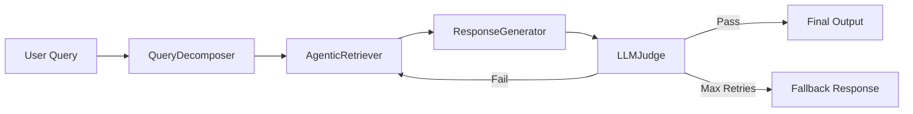

## Overview

DocMind is built around a modular, pipeline-based architecture that separates concerns and enables isolated testing and component substitution. The system processes natural language queries through five specialized stages, each implemented as an independent component.

## Architecture Diagram



## Core Components

### QueryDecomposer

**Location:** `components.py:8-63`

Extracts structured information from natural language queries using regex-based pattern matching:

- **Intent classification** - Identifies query type (penalty, payment_terms, IP, etc.)
- **Entity extraction** - Extracts relevant terms, filtering stopwords
- **Constraint parsing** - Captures timeframes, percentages, dates
- **Temporal extraction** - Identifies temporal references (dates, deadlines)

### AgenticRetriever

**Location:** `components.py:66-144`

Implements strategic section selection with multi-signal scoring:

- Maps intents to relevant document sections
- Combines full-text search with semantic scoring
- Applies relevance thresholds (2.0) to filter noise
- Returns 3-5 most relevant sections with page numbers

### ResponseGenerator

**Location:** `components.py:311-329`

Generates responses with source citations:

- Extracts key sentences from retrieved sections
- Includes section titles and page numbers
- Formats output for readability

### LLMJudge

**Location:** `components.py:147-308`

Validates generated responses for factual accuracy:

- Extracts individual claims (quantitative, temporal, obligations)
- Finds supporting evidence in source documents
- Detects contradictions between claims and sources
- Calculates confidence scores with weighted penalties

## State Management

The system uses LangGraph's StateGraph with a TypedDict state object:

```python
class DocMindState(TypedDict):
    query: str
    decomposition: Optional[Dict]
    retrieved_sections: List[Dict]
    generated_response: Optional[str]
    judge_verdict: Optional[Dict]
    final_output: Optional[str]
    retry_count: int
    node_history: List[str]
```

**Location:** `state_types.py:3-11`

State flows through the pipeline, accumulating data at each stage. The `retry_count` prevents infinite loops, and `node_history` tracks execution for debugging.

## Design Principles

### Modularity

Each component has a single responsibility and can be tested in isolation:

```python
# components.py demonstrates clear separation
class QueryDecomposer:  # Only handles query parsing
class AgenticRetriever:  # Only handles retrieval
class ResponseGenerator:  # Only handles generation
class LLMJudge:  # Only handles validation
```

### Deterministic Control

Regex-based decomposition provides predictable, testable behavior:

<Info>
From README.md:47-54: "Why not use LLM for decomposition: adds 200-500ms latency, costs tokens, regex is sufficient for limited legal vocabulary, and it's deterministic and testable."
</Info>

### Transparent Reasoning

Every decision is logged and traceable:

- Query decomposition results
- Retrieval scores and selected sections
- Judge evaluations with claim-by-claim analysis
- Retry attempts and workflow execution

### Fail-Safe Mechanisms

- **Maximum retry limit:** 2 attempts (components.py:nodes.py:52)
- **Relevance thresholds:** 2.0 minimum score (components.py:135)
- **Fallback responses:** When confidence is insufficient (nodes.py:43)

## Data Flow

1. **Input:** User submits natural language query
2. **Decomposition:** Extract intent, entities, constraints
3. **Retrieval:** Score and select relevant document sections
4. **Generation:** Create response with citations
5. **Validation:** Judge checks for hallucinations
6. **Decision:**
   - If pass: Return response
   - If fail + retries < 2: Retry retrieval
   - If fail + retries >= 2: Return fallback

## Known Limitations

From README.md:60-63:

<Note>
- Regex-based intent doesn't generalize beyond defined vocabulary
- Manual scoring doesn't learn from feedback
- Judge makes single-pass decisions without revision
- System depends on specific mock data structure
</Note>

These are acceptable simplifications for the assessment scope but would need addressing in production.

## Next Steps

<CardGroup cols={2}>
  <Card title="Query Decomposition" icon="magnifying-glass" href="/concepts/query-decomposition">
    Deep dive into regex patterns and intent extraction
  </Card>
  <Card title="Agentic Retrieval" icon="database" href="/concepts/agentic-retrieval">
    Learn how strategic retrieval works
  </Card>
  <Card title="LLM Judge" icon="gavel" href="/concepts/llm-judge">
    Understand hallucination detection
  </Card>
  <Card title="LangGraph Workflow" icon="diagram-project" href="/concepts/langgraph-workflow">
    See how components orchestrate
  </Card>
</CardGroup>