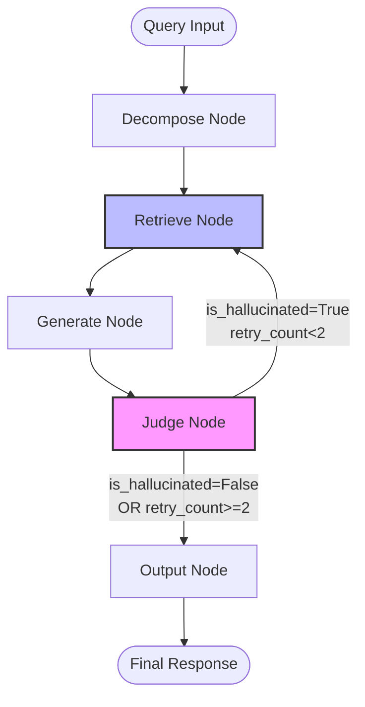

## Overview

DocMind uses [LangGraph](https://langchain-ai.github.io/langgraph/) to orchestrate its multi-stage pipeline. LangGraph provides:

- **State management** - Typed dictionary passed between nodes
- **Conditional edges** - Dynamic routing based on validation results
- **Cycle detection** - Prevents infinite retry loops
- **Execution history** - Tracks node visitation for debugging

## Workflow Graph



## State Definition

**Location:** `state_types.py:3-11`

```python
from typing import TypedDict, List, Optional, Dict

class DocMindState(TypedDict):
    query: str                          # User's natural language query
    decomposition: Optional[Dict]        # Structured query components
    retrieved_sections: List[Dict]       # Document sections from retrieval
    generated_response: Optional[str]    # Generated answer with citations
    judge_verdict: Optional[Dict]        # Validation results
    final_output: Optional[str]          # Final response to user
    retry_count: int                     # Number of retrieval retries
    node_history: List[str]              # Nodes visited (for debugging)
```

The state flows through the pipeline, accumulating data at each stage.

<Info>
LangGraph passes the **entire state object** to each node. Nodes can read any field but should only modify fields they own.
</Info>

## Node Implementations

### 1. Decompose Node

**Location:** `nodes.py:7-12`

```python
async def decompose_node(state: DocMindState) -> DocMindState:
    decomposer = QueryDecomposer()
    decomposition = await decomposer.decompose(state["query"])
    state["decomposition"] = decomposition
    state["node_history"] = state.get("node_history", []) + ["decompose"]
    return state
```

**Responsibilities:**
- Parse natural language query
- Extract intent, entities, constraints, temporals
- Store result in `state["decomposition"]`

### 2. Retrieve Node

**Location:** `nodes.py:14-20`

```python
async def retrieve_node(state: DocMindState) -> DocMindState:
    store = MockDocumentStore()
    retriever = AgenticRetriever(store)
    sections = await retriever.retrieve(state["query"], state["decomposition"])
    state["retrieved_sections"] = sections
    state["node_history"] = state.get("node_history", []) + ["retrieve"]
    return state
```

**Responsibilities:**
- Score document sections based on decomposition
- Apply relevance filtering (threshold 2.0)
- Return top 3-5 sections with page numbers
- Store result in `state["retrieved_sections"]`

<Tip>
This node can be executed **multiple times** if the judge detects hallucinations.
</Tip>

### 3. Generate Node

**Location:** `nodes.py:22-27`

```python
async def generate_node(state: DocMindState) -> DocMindState:
    generator = ResponseGenerator()
    response = generator.generate(state["retrieved_sections"])
    state["generated_response"] = response
    state["node_history"] = state.get("node_history", []) + ["generate"]
    return state
```

**Responsibilities:**
- Extract key information from retrieved sections
- Format response with citations (title, page number)
- Store result in `state["generated_response"]`

### 4. Judge Node

**Location:** `nodes.py:29-37`

```python
async def judge_node(state: DocMindState) -> DocMindState:
    judge = LLMJudge()
    verdict = await judge.evaluate(state["generated_response"], state["retrieved_sections"])
    state["judge_verdict"] = verdict
    state["node_history"] = state.get("node_history", []) + ["judge"]
    
    # Increment retry count if hallucinated
    if verdict.get("is_hallucinated", False):
        state["retry_count"] = state.get("retry_count", 0) + 1
    
    return state
```

**Responsibilities:**
- Extract claims from generated response
- Find supporting evidence in retrieved sections
- Detect contradictions
- Calculate confidence score
- **Increment retry counter** if hallucinated
- Store verdict in `state["judge_verdict"]`

<Warning>
The judge increments `retry_count` but does NOT decide whether to retry. That decision is made by the `should_retry` conditional function.
</Warning>

### 5. Output Node

**Location:** `nodes.py:39-45`

```python
async def output_node(state: DocMindState) -> DocMindState:
    if state["judge_verdict"] and state["judge_verdict"].get("should_return", False):
        state["final_output"] = state["generated_response"]
    else:
        state["final_output"] = "Unable to provide a confident response. Please rephrase your query."
    state["node_history"] = state.get("node_history", []) + ["output"]
    return state
```

**Responsibilities:**
- Check if response passed validation
- Return generated response OR fallback message
- Store result in `state["final_output"]`

## Conditional Routing

### Retry Decision Logic

**Location:** `nodes.py:47-55`

```python
def should_retry(state: DocMindState) -> str:
    verdict = state.get("judge_verdict", {})
    retry_count = state.get("retry_count", 0)
    
    # Retry if hallucinated and haven't exceeded max retries (2 attempts max)
    if verdict.get("is_hallucinated", False) and retry_count < 2:
        log_retry_attempt(retry_count + 1, 2)
        return "retry"
    return "output"
```

**Returns:**
- `"retry"` → Route back to retrieve node
- `"output"` → Route to output node

<Info>
Maximum 2 retry attempts (total 3 retrieval passes). From README.md:47-48: "Maximum 2 retries to avoid infinite loops. If retrieval fails twice, the information probably doesn't exist in the documents."
</Info>

## Graph Construction

**Location:** `workflow.py:6-34`

```python
from langgraph.graph import StateGraph, END
from nodes import decompose_node, generate_node, judge_node, output_node, retrieve_node, should_retry
from state_types import DocMindState

def build_graph_workflow() -> StateGraph:
    workflow = StateGraph(DocMindState)

    # Add nodes
    workflow.add_node("decompose", decompose_node)
    workflow.add_node("retrieve", retrieve_node)
    workflow.add_node("generate", generate_node)
    workflow.add_node("judge", judge_node)
    workflow.add_node("output", output_node)
    
    # Define edges (sequential flow)
    workflow.set_entry_point("decompose")
    workflow.add_edge("decompose", "retrieve")
    workflow.add_edge("retrieve", "generate")
    workflow.add_edge("generate", "judge")
    
    # Conditional edge (retry logic)
    workflow.add_conditional_edges(
        "judge",
        should_retry,
        {
            "retry": "retrieve",
            "output": "output"
        }
    )
    
    workflow.add_edge("output", END)
    
    return workflow.compile()
```

### Edge Types

**Static edges** (unconditional):
```python
workflow.add_edge("decompose", "retrieve")  # Always goes to retrieve
workflow.add_edge("retrieve", "generate")   # Always goes to generate
workflow.add_edge("generate", "judge")      # Always goes to judge
workflow.add_edge("output", END)            # Always ends
```

**Conditional edge** (dynamic routing):
```python
workflow.add_conditional_edges(
    "judge",              # Source node
    should_retry,         # Decision function
    {
        "retry": "retrieve",   # If function returns "retry"
        "output": "output"     # If function returns "output"
    }
)
```

## Execution Example

### Scenario 1: Successful First Pass

```python
query = "What are the late payment penalties?"

# Initial state
state = {
    "query": query,
    "retry_count": 0,
    "node_history": []
}

# Execute workflow
result = await workflow.ainvoke(state)

print(result["node_history"])
# Output: ["decompose", "retrieve", "generate", "judge", "output"]

print(result["final_output"])
# Output: "If payment is not received within thirty (30) days, Client shall be assessed a late fee of 1.5% per month... (See Late Payment Penalties, page 8)"
```

### Scenario 2: Retry After Hallucination

```python
query = "What are the penalties?"

# Assume first retrieval returns wrong section
# Generated response: "Late fee is 5% per month"
# Judge detects contradiction (5% ≠ 1.5%)

print(result["node_history"])
# Output: ["decompose", "retrieve", "generate", "judge", "retrieve", "generate", "judge", "output"]
#                                                    ^^^^^^^^^^^^^^^^^^^^^^^^^
#                                                    Retry attempt

print(result["retry_count"])
# Output: 1
```

### Scenario 3: Max Retries Exceeded

```python
query = "What is the warranty period?"  # Not in contract

# First attempt: Retrieves irrelevant sections → Judge rejects
# Second attempt: Retrieves different sections → Judge rejects
# Third attempt: Skip (max retries reached)

print(result["node_history"])
# Output: ["decompose", "retrieve", "generate", "judge", "retrieve", "generate", "judge", "output"]

print(result["retry_count"])
# Output: 2

print(result["final_output"])
# Output: "Unable to provide a confident response. Please rephrase your query."
```

## Design Decisions

From README.md:44-50:

### Why LangGraph?

<Info>
**Modularity:** "Why separate modules: allows isolated unit tests (test judge without retriever), component substitution (swap mock for real), clear responsibilities."
</Info>

### Why Retry Retrieval?

From README.md:47-48:

<Info>
"If the judge detects hallucination, the system retries retrieval. Maximum 2 retries to avoid infinite loops. If retrieval fails twice, the information probably doesn't exist in the documents."
</Info>

### Why Track Node History?

The `node_history` field enables:
- Debugging execution paths
- Performance profiling (count node visits)
- Testing workflow correctness
- Logging for observability

## State Flow Diagram

```
Initial State:
{
  query: "What are the penalties?",
  retry_count: 0,
  node_history: []
}

↓ decompose_node

{
  query: "What are the penalties?",
  decomposition: {intent: "penalty", entities: ["penalties"]},
  retry_count: 0,
  node_history: ["decompose"]
}

↓ retrieve_node

{
  ...,
  retrieved_sections: [{title: "Late Payment Penalties", page_num: 8, ...}],
  node_history: ["decompose", "retrieve"]
}

↓ generate_node

{
  ...,
  generated_response: "Late fee of 1.5% per month... (page 8)",
  node_history: ["decompose", "retrieve", "generate"]
}

↓ judge_node

{
  ...,
  judge_verdict: {is_hallucinated: False, confidence_score: 1.0, ...},
  retry_count: 0,
  node_history: ["decompose", "retrieve", "generate", "judge"]
}

↓ should_retry → "output"

↓ output_node

{
  ...,
  final_output: "Late fee of 1.5% per month... (page 8)",
  node_history: ["decompose", "retrieve", "generate", "judge", "output"]
}
```

## Testing

```python
from workflow import build_graph_workflow

# Build workflow
workflow = build_graph_workflow()

# Test successful path
state = {
    "query": "What are the payment terms?",
    "retry_count": 0,
    "node_history": []
}

result = await workflow.ainvoke(state)
assert "output" in result["node_history"]
assert result["final_output"] is not None
assert result["retry_count"] <= 2

# Test retry logic
state = {
    "query": "What are the penalties?",
    "retry_count": 0,
    "node_history": []
}

# Mock judge to always fail
with patch("components.LLMJudge.evaluate") as mock_judge:
    mock_judge.return_value = {"is_hallucinated": True, "should_return": False}
    result = await workflow.ainvoke(state)
    assert result["retry_count"] == 2
    assert result["node_history"].count("retrieve") == 3  # Initial + 2 retries
```

## Execution

```python
from workflow import build_graph_workflow

async def main():
    workflow = build_graph_workflow()
    
    initial_state = {
        "query": "What are the late payment penalties?",
        "retry_count": 0,
        "node_history": []
    }
    
    result = await workflow.ainvoke(initial_state)
    print(result["final_output"])

if __name__ == "__main__":
    import asyncio
    asyncio.run(main())
```

## Next Steps

<CardGroup cols={2}>
  <Card title="Architecture Overview" icon="sitemap" href="/concepts/architecture">
    Understand the overall system design
  </Card>
  <Card title="Query Decomposition" icon="magnifying-glass" href="/concepts/query-decomposition">
    See how queries are parsed
  </Card>
  <Card title="Agentic Retrieval" icon="database" href="/concepts/agentic-retrieval">
    Learn about strategic retrieval
  </Card>
  <Card title="LLM Judge" icon="gavel" href="/concepts/llm-judge">
    Deep dive into validation
  </Card>
</CardGroup>